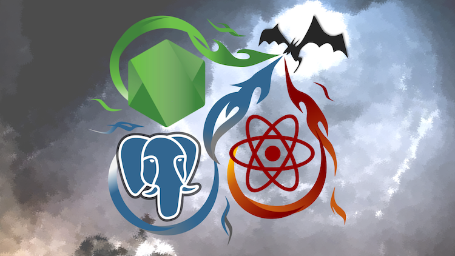

### Master Full-Stack Development | Node, SQL, React, and More

The official code for the *Master Full-Stack Development | Node, SQL, React, and More* course on Udemy by David Joseph Katz.

## Check out the course:
**[https://www.udemy.com/full-stack](https://www.udemy.com/full-stack)**

This course is a full-stack web application with both a backend and a frontend. It uses Node.js, Express.js, and PostgreSQL on the backend to create a server, create an API, and manage the database. For the frontend, Dragonstack uses React.js, Redux, and various JavaScript modules.

Some of the main course highlights:
- Build a backend server with Node.js and Express.js.
- Create a full-on API with GET, POST, and PUT requests.
- Build components with React.js.
- Manage the internal state of the frontend with Redux.
- Discover best practices around naming and structure.
- Understand the guiding principles of simplicity and singularity.
- Deeply dive into JavaScript Promises.
- Thoroughly explore the Node.js event loop and v8 engine.
- Create a full-on secure authentication system.

Ultimately, this course will set you well on your way in the industry. Thorough knowledge of the full-stack will make you capable of earning and thriving in backend, frontend, or full-stack positions.